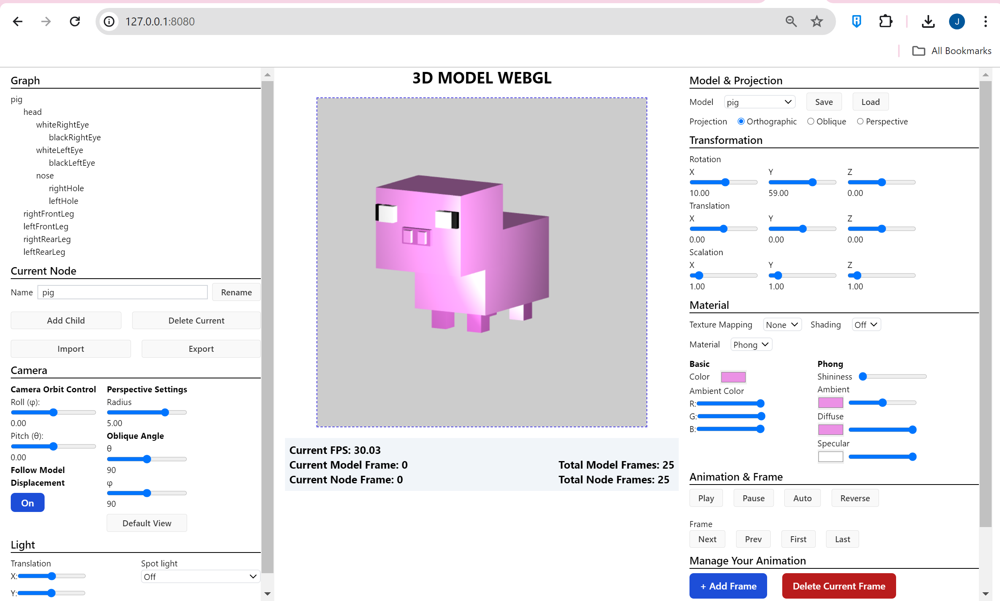

# Tugas Besar 2 - IF3260

For Computer Graphics Course - IF3260



## Deskripsi
WebGL (Web Graphics Library) merupakan API Javascript untuk melakukan rendering grafik 2D dan 3D pada web browser anda. 
Tugas Besar 2 - IF3260 Grafika Komputer 3D Model WebGL merupakan pembuatan 3D engine yang memanfaatkan WebGL dan primitif yang dibuat dari <i>scratch</i>. 

Kami mengimplementasikan model <i>hollow</i> dan <i>articulated</i> yang dilengkapi dengan animasi. Definisi model dan animasi disimpan pada file berformat json yang dapat dilihat pada folder `test` sebagai contoh implementasinya.

Fitur-fitur dan cara praktis penggunaan aplikasi ini dapat diakses pada folder guide atau [link berikut](https://github.com/GAIB20/tugas-besar-grafkom-2-yaampun/blob/main/guide/guide.pdf)

## Cara Menjalankan Program

```
0. Clone this repo
1. run `npm i`
2. run `npm run dev`
3. open `127.0.0.1:8080` in your web Browser
```

## Model
| Nama | NIM | Model |
|------|-----|--------|
| Febryan Arota Hia | 13521120 | Pig & HollowThingy |
| Asyifa Nurul Shafira | 13521125 | Fox & Hollow Cube |
| Jeremya Dharmawan Raharjo | 13521131 | Chicken & Ring |

`*tiap model sudah mengandung animasi`

## Pembagian Kerja
| Nama | NIM | Tugas |
|------|-----|--------|
| Febryan Arota Hia | 13521120 |<ul><li>Material & lighting</li><li>Diffuse Texture</li><li>Scene Graph</li><li>Component Editor</li><li>Spotlight</li></ul> |
| Asyifa Nurul Shafira | 13521125 | <ul><li>Tekstur</li></ul>|
| Jeremya Dharmawan Raharjo | 13521131 |<ul><li>Camera</li><li>Animation</li><li>Animation Editor</li><li>Simple Character Controller</li></ul>  |